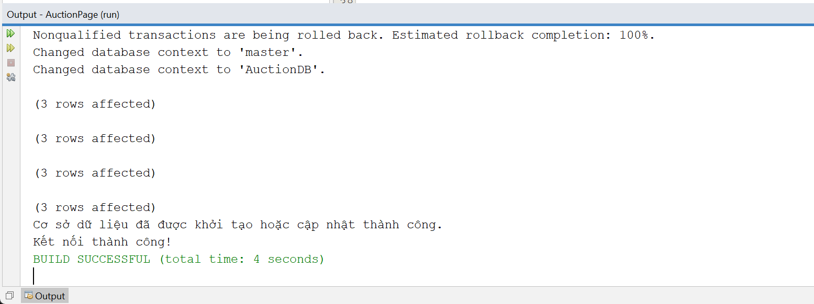

# AuctionPage

## Introduction

This is a Java project developed using NetBeans 13, as part of the PRJ course at FPT University. The project is a web auction platform.

The main goal of this project is to build an online auction website where users can bid on various items. The website provides features such as user registration, item listing, bidding, and winner notification.

## System Requirements

- Java Development Kit (JDK) version 8 or above.
- NetBeans IDE version 13.
- SQL Server

## Installation

1. Clone the repository from GitHub by running the following command:

   ```
   git clone https://github.com/khengyun/AuctionPage.git
   ```

2. Open NetBeans IDE and import the project into the IDE by selecting **File > Open Project** and choosing the folder where the cloned repository is located.

3. Set up a SQL Server database for the project. You can use tools like Microsoft SQL Server Management Studio to create the necessary database tables.

4. Configure the database connection in the project. Open the `src/DBconnect/DBconnector.java` file and update the `username` and `password` variables with your SQL Server database credentials.

5. Build the project by selecting **Run > Build Project** or using the shortcut `Shift + F11`.

6. Run the `src/DBconnect/DBconnector.java` file to initialize the database. This file will execute a batch script to create and populate the necessary database tables. Make sure to provide the correct `username` and `password` in the script. 

      
     

7. After running the script, you can run the application by selecting **Run > Run Project** or using the shortcut `F6`.

## Directory Structure

The project directory structure is as follows:

- `src`: Contains the main source code files.
- `lib`: Contains any external libraries or dependencies used in the project.
- `docs`: Contains project documentation and user manuals.
- `resources`: Contains any additional resources such as images or configuration files.

## Documentation

- [Link to project documentation](docs/documentation.md)
- [Link to API documentation](docs/api.md)

## Contributions

Contributions from the community are welcome. If you find any issues or have suggestions for improvements, please create a new issue or send a pull request.

## Author

The project is developed by [khengyun](https://github.com/khengyun). You can contact me through my GitHub profile.

## License

This project is distributed under the [MIT License](LICENSE). See the `LICENSE` file for more information.

## Resources

- [Official Java Documentation](https://docs.oracle.com/en/java/)
- [NetBeans IDE Documentation](https://netbeans.apache.org/documentation/)
- [FPT University PRJ Course Materials](https://www.fpt.edu.vn/)